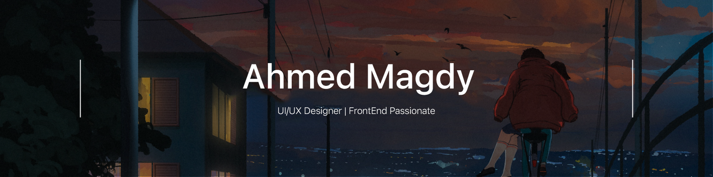

### 

I'm a software engineering student with a passion for web programming. My goal is to develop scalable, maintainable and user-friendly web applications that provide a seamless user experience. I am constantly learning and experimenting with new technologies and frameworks to find the best solutions to the problems at hand, in addition to being a UI/UX Designer for 4 years. 

  <h1> Hi there 👋,Call me Ahmed.</h1>
  

##

 

<be>

- 🔭 I’m currently studying on **becoming a UI/UX Designer**.

- 🌱 I’m currently learning **React | Angular**.

- 🔍 Take a look at my projects on [**Frontend Mentor**](https://www.frontendmentor.io/profile/Magdy78)!.

- 📫 How to reach me: **ahmed.magdybus@gmail.com**.

- 💬 Ask me about **HTML and CSS** and maybe **Interaction Desgin**.

- 🤝 I’m looking for help in learning about **Accessible Websites**.

- 👯 I’m looking to collaborate on **developing new open-source projects**.

 
 

## 🏆 Goals

- 📖 Learn the basics of **FrontEnd Development** World
- 🚀 Gain experience in developing full-stack applications using **React** and **Node.js**.
- 🌐 Improve my knowledge of web accessibility standards and incorporate them into my projects.
- 🎨 Learn new design techniques and tools to enhance my UI/UX design skills.

## 🎯 Future Goals

- 🌟 Share my knowledge and experience by teaching and mentoring others in the tech community.
- 🧠 Study the fundamentals of **UX Design** and its various subfields.
- 🤖 Build a project that demonstrates my knowledge of **AI** and **machine learning**.

## 📈 Achievements

- 🎉 I have successfully completed the Militia ProxyWar Project With **QuickSand Studios**.
- 🤝 Working on Graduation Project **RentMen**.

#

 

<h2>📫 Connect with me</h2>

    
&nbsp;
&nbsp;
 

  

 
<h2>📊 Github Stats</h2>

### :fire: My Stats :

<h2>🛠️ Languages and Tools</h2>

<b>🏄‍♂️ Frontend</b>

 
  
&nbsp;
&nbsp;
&nbsp;
&nbsp;
&nbsp;

<b>🧰 Backend</b>

 

&nbsp;
&nbsp;
&nbsp;

<b>💻 Software and Tools</b>

 

&nbsp;
&nbsp;
&nbsp;
 
&nbsp;
&nbsp;

- ⚡ Fun fact: **I Love Football and Priemer League**

